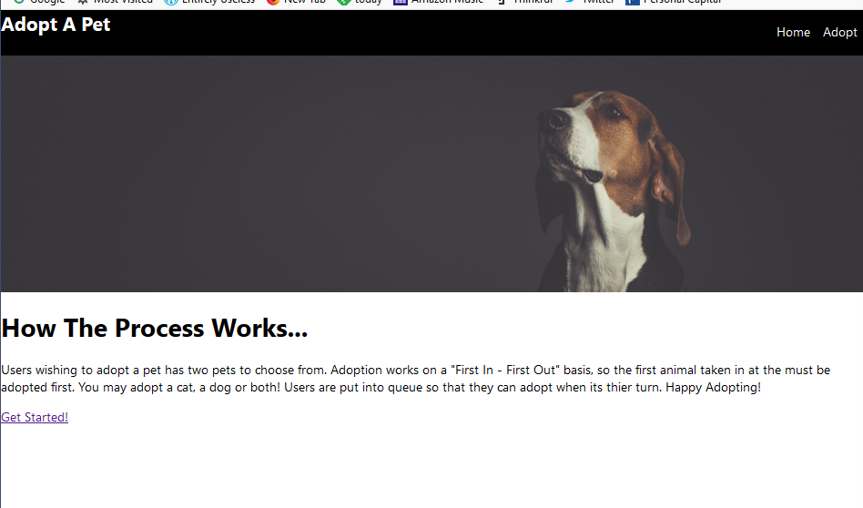
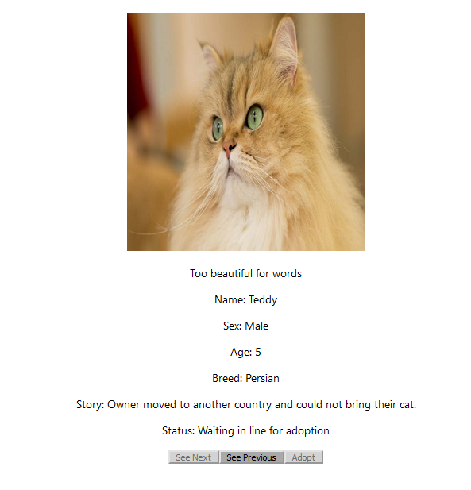

# Petful

## Authors

David Bolin
Quonn Bernard

## Summary
A web app for a first-in-first-out pet adoption agency. The user is told how many others are waiting to adopt and can only adopt when the others have taken their turns. At that point the user can only adopt a cat or a dog or both, but only the ones first in their respective lines.

## Live app

The live app is [here](https://wiki-app.davidbolin1016.now.sh/).

## Screenshots

## Tech stack

The client uses CSS3 and JavaScript ES6 together with React.

The server is also in JavaScript (at [https://github.com/davidbolin1016/wiki-server]) and uses Express, as well as PostgreSQL for the database.

## Code base

The source folder has three sub-folders, "components," "services," and "user-context."

UserContext creates a context with username and homepage id so that the app can keep track of the current user.

The services folder contains files for communicating with the server, whether for login or for retreiving or posting information to or from the server.

The components folder contains files creating React components for the main app (App), each distinct page (EditPage, LandingPage, ListPage, NotFound, PersonalPage, RegistrationPage, SignIn), as well as several reusable components (NavBar, Emoji, List).

## API documentation

API documentation can be found at the [repo for the server.](https://github.com/davidbolin1016/wiki-server) 